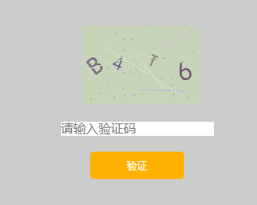

## 验证码组件 其他框架也能用
- 如图  

```
  <verification @verificationCode="getCode"></verification>
  其他参数
    props: {
            width: {   //  验证码宽度
                type: Number,
                default: 150,
                validator: function (value) {
                    return value >= 50
                }
            },
            height: {   //  验证码高度
                type: Number,
                default: 100,
                validator: function (value) {
                    return value >= 50
                }
            },
            interferenceLineNum: {   //  干扰线的条数
                type: Number,
                default: 5,
                validator: function (value) {
                    return value >= 0
                }
            },
            interferenceSpotNum: {   //  干扰点的个数
                type: Number,
                default: 40,
                validator: function (value) {
                    return value >= 10
                }
            },
            minFontSize: {   //  最小字体大小
                type: Number,
                default: 18,
                validator: function (value) {
                    return value >= 15
                }
            },
            maxFontSize: {   //  干扰点的个数
                type: Number,
                default: 40,
                validator: function (value) {
                    return value >= 18 && value <= 50
                }
            },
            codeNum: {   //  验证码个数
                type: Number,
                default: 4,
                validator: function (value) {
                    return value >= 3 && value <= 20
                }
            }
        }
```