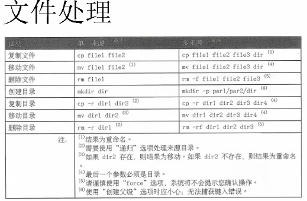

# 目录操作
#### 1 切换用户  
- su 例 su huangqiyong;  
#### 2 快捷键  
- ctrl+a,把光标调到命令行开头  
- ctrl+u，删除光标到最开始的内容  
- ctrl+k，删除光标到最后的内容  
- ctrl+r，搜索之前的命令，需要输入模糊查询  
- ctrl+l，清屏  
- history 显示历史命令，然后！[num]可以运行那个命令
- pwd  查看当前目录所在的位置  
#### 3 ls   查看当前路径下的文件
- 加 -d 只看当前目录的信息
- 加-l  查看详细信息
- 加-a  显示所有文件，包括隐藏文件。隐藏文件前面加了.
- 加-h  显示文件大小 **可以组合使用  例：ls -d -a**  
#### 3 cd 切换
- cd / 切换到根目录  
- cd - 返回之前的目录
- cd .. 返回上一级目录  .是当前目录，..上一级目录
- cd ~  返回到用户所在的家目录
* * *
# 文件操作
- 用 ls -l 查看，**d**开头的 ：表示目录，**-**开头：表示文件，**l**：连接文件，**b**：设备文件，提供存储的接口设备，**c**：设备文件，提供串行的接口设备-键盘
- 创建目录 mkdir hqy    
创建文件 touch hqy  
删除文件 rm hqy  
复制文件 cp hqy a  复制hqy更名为a  
复制多个文件 cp hqy a /xx  必须先创建目录xx  
文件操作：
