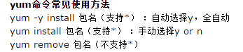

# 目录操作
#### 1 切换用户  
```
su 例 su huangqiyong;  
```
#### 2 快捷键  
- ctrl+a,把光标调到命令行开头  
- ctrl+u，删除光标到最开始的内容  
- ctrl+k，删除光标到最后的内容  
- ctrl+r，搜索之前的命令，需要输入模糊查询  
- ctrl+l，清屏  
- history 显示历史命令，然后！[num]可以运行那个命令
- pwd  查看当前目录所在的位置  
#### 3 ls   查看当前路径下的文件
- 加 -d 只看当前目录的信息
- 加-l  查看详细信息
- 加-a  显示所有文件，包括隐藏文件。隐藏文件前面加了.
- 加-h  显示文件大小 **可以组合使用  例：ls -d -a**  
#### 3 cd 切换
- cd / 切换到根目录  
- cd - 返回之前的目录
- cd .. 返回上一级目录  .是当前目录，..上一级目录
- cd ~  返回到用户所在的家目录
* * *
# 文件操作
- 用 ls -l 查看，**d**开头的 ：表示目录，\-开头：表示文件，**l**：连接文件，**b**：设备文件，提供存储的接口设备，**c**：设备文件，提供串行的接口设备-键盘
- 如图  
  
mv 是重命名 mv a b，把a文件改名为b，假如a是文件，b是目录，则是把a移动到b目录下。  
创建文件：touch xx,创建xx文件  
rm -f a b c,-f 强制删除
- 查看文件  
cat hqy ，查看hqy文件里面的内容
- 编辑文件  
vim hqy 进入文件  
  
按i 插入修改，esc退出操作，y复制...  
:w保存，：wq保存并退出，：q！强退
* * *
# 关机操作
- 注意  
  
sync 数据保存到磁盘  
- shutdown  
  
一般用 shutdown -h now 马上关机  
shutdown -h 12:00：12点关机 或 shutdown -h +10：10小时后  
* * *
# 软件安装
- Yum安装  
   
 查看yum源里面的版本：yum list | grep nginx  
 如果发现其中没有你要的版本，就自己创建一个yum仓库，例：vim /etc/yum.repos.d/nginx.repo（新建一个nginx仓库），在里面写入nginx网络资源，把以下资源放入，：wq保存退出就行了，退出后yum list | grep nginx，查看yum里面的版本。  
 
# nginx
~~~
nginx 启动   
killall nginx 关闭进程   
lsof -i :8080 查看端口进程   
nginx -s stop 关闭   
nginx -s reload 重启
~~~
