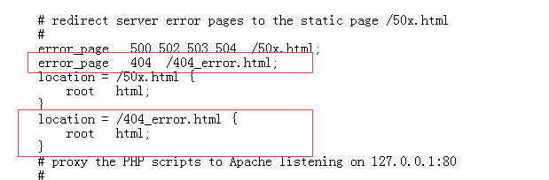
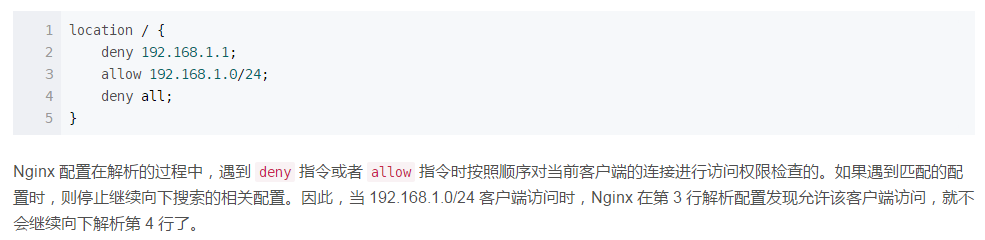
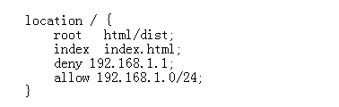

# nginx
### linux下的基础操作
- 防火墙
~~~
# 开启
service firewalld start
# 重启
service firewalld restart
# 关闭
service firewalld stop
#禁止开启重启
systemctl disable firewalld.service 
~~~
- 进程
~~~
killall nginx 关闭进程
~~~
- nginx 启动      
~~~
service nginx start  启动nginx
nginx -s quit     从容停止nginx nginx自己的命令 都是nginx -s 开头，stop停止，quit从容停止，在任务做完后停止
service nginx stop  停止
service nginx restart 重启
nginx -s reload 在重新编写或者修改Nginx的配置文件后，都需要作一下重新载入
lsof -i :8080 查看端口进程
netstat -tlnp 查看所有端口

###window下
     start nginx 启动命令   
     nginx -s quit 从容停止
     nginx -s stop 停止命令   
     nginx -s reload 重启命令 
~~~
***
### 错误页面设置
- 当出现错误时候跳转页面设置
   
设置404错误，并设置跳转到的页面和跳转情况，在文件html下加404_error.html文件就行了
### ip权限访问
~~~
allow:允许访问的ip，不能同时设置多个，如果有多个 IP 需要设置，需要重复使用 allow 指令，allow all（全部访问）
deny ：禁止ip，和上面一样。
~~~
  
### 权限详解
